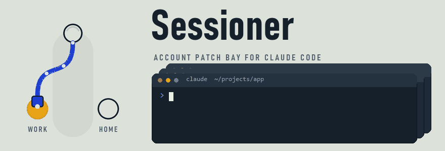

<h1 align="center">
  
</h1>

Save your Claude Code accounts, choose the active login, and turn on account switching when a usage allowance runs out. Keep working in ordinary Claude Code; Claude handles your conversation and context.

## Get started

On Windows, install [uv](https://docs.astral.sh/uv/) and Claude Code, then sign in to your first Claude account. Open PowerShell in this directory and run:

```powershell
.\setup.ps1
.\desktop.ps1
```

Open the Sessioner desktop shortcut for everyday use. Its dashboard guides you through saving your current login and a different backup account. Complete `/login` in ordinary Claude when prompted, then return to save the login. Existing saved accounts are kept. Terminal setup is also available with `.\sessioner.ps1 setup`.

Your saved accounts are jacks on a patch bay and the cord is plugged into the one Claude is using: drag the plug onto another account to switch, or press its **Switch** button. **Details** opens an account's limits and reset countdowns. The **Switching** tab holds setup health, switch history, watcher controls, privacy, and notifications. It runs on this computer.

You can leave a Claude conversation open during setup. Afterward, use `/hooks` in that conversation to confirm `StopFailure` with `rate_limit`. See [using an existing conversation](docs/existing-conversation.md) if it does not appear.

## Everyday use

```powershell
.\sessioner.ps1                 # Status and a quick action menu
.\sessioner.ps1 accounts        # Your saved accounts
.\sessioner.ps1 switch backup   # Choose an account
.\sessioner.ps1 rename backup home   # Give an account a new name
.\sessioner.ps1 off             # Turn off automatic switching
.\sessioner.ps1 doctor          # Find a setup problem and the next step
```

The PowerShell command works without activating an environment or changing your PATH. [All commands](docs/commands.md) include adding more accounts, turning switching back on, and checking status.

## How switching works

When Claude reports a rate limit, Sessioner checks whether the current account's usage allowance is used up. It changes the active login only when another enabled, different saved account has fresh usage (checked within five minutes) with room on every window. When several qualify, it prefers the one whose limits reset soonest, then the one with the most room, then the first saved. Unknown or malformed reset times are shown as unknown and never drive a switch.

An optional reset watcher can re-check usage on a timer and switch for you. Enable it in **Switching**, then keep the desktop app running. Closing the browser leaves the tray and enabled watcher running; **Quit** stops them. The tray shows the active account, next reset, and watcher status, and lets you switch accounts or reopen the dashboard. Notifications report switches, exhaustion, recovered quota, and login problems. Browser-only mode (`.\sessioner.ps1 ui`) and the terminal watcher (`.\sessioner.ps1 watch`) remain available.

Turn on **Account-only privacy mode** in **Switching** to disable session and token statistics. Sessioner then skips conversation logs and session metadata, clears cached statistics, and keeps account switching and plan quota checks working. Statistics are enabled by default; when enabled, local Claude logs are read to extract counts, models, times, and folders. Message text is never stored or displayed by Sessioner.

Sessioner changes the account login. Continue or retry through Claude's normal interface; the hook cannot request another turn. [Claude's hook reference](https://code.claude.com/docs/en/hooks#stopfailure). Adoption of the new login by a running Claude process still needs a real two-account test. Read [the conversation guide](docs/existing-conversation.md) for the fallback.

## Guides

- [Getting started](docs/getting-started.md)
- [Using an existing conversation](docs/existing-conversation.md)
- [Commands and saved data](docs/commands.md)
- [Troubleshooting](docs/troubleshooting.md)
- [Development and verification](docs/development.md)
- [Licenses](docs/credits.md)

Sessioner is [MIT licensed](LICENSE). See [third-party notices](THIRD_PARTY_NOTICES.md) for bundled component licenses and attribution.
